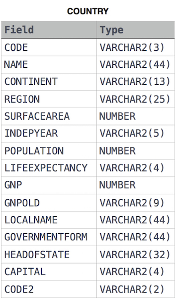

Given the CITY and COUNTRY tables, query the names of all the continents (COUNTRY.Continent) and their respective average city populations (CITY.Population) rounded down to the nearest integer.

Note: CITY.CountryCode and COUNTRY.Code are matching key columns.




```roomsql
select cou.continent, floor(avg(c.population)) as respectiveAverageCityPopulations 
from city c
join country cou on cou.code = c.countrycode
group by cou.continent;
```