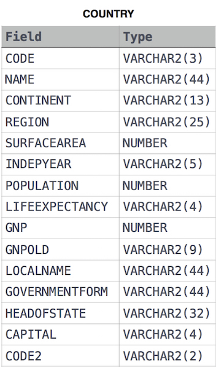

Given the CITY and COUNTRY tables, query the sum of the populations of all cities where the CONTINENT is 'Asia'.




```roomsql
select sum(c.population)
from city c
join country cou on c.countrycode = cou.code
where continent = 'Asia';
```
