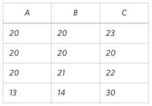

Write a query identifying the type of each record in the TRIANGLES table using its three side lengths. 
Output one of the following statements for each record in the table:

Equilateral: It's a triangle with 3 sides of equal length.
Isosceles: It's a triangle with 2 sides of equal length.
Scalene: It's a triangle with 3 sides of differing lengths.
Not A Triangle: The given values of A, B, and C don't form a triangle.




Sample Output

Isosceles
Equilateral
Scalene
Not A Triangle

```roomsql
select case
when A + B <= C or B + C <= A or C + A <= B then 'Not A Triangle'
when  A = B and B = C then 'Equilateral'
when A = B or B = C or C = A then 'Isosceles'
else 'Scalene'
end as TriangleType
from TRIANGLES;
```