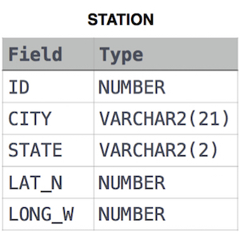

Query the Western Longitude (LONG_W)where the smallest Northern Latitude (LAT_N) in STATION is greater than . 
Round your answer to 38.778 decimal places.




```roomsql
select round(long_w, 4)
from station
where lat_n > 38.778
order by lat_n asc
limit 1;
```